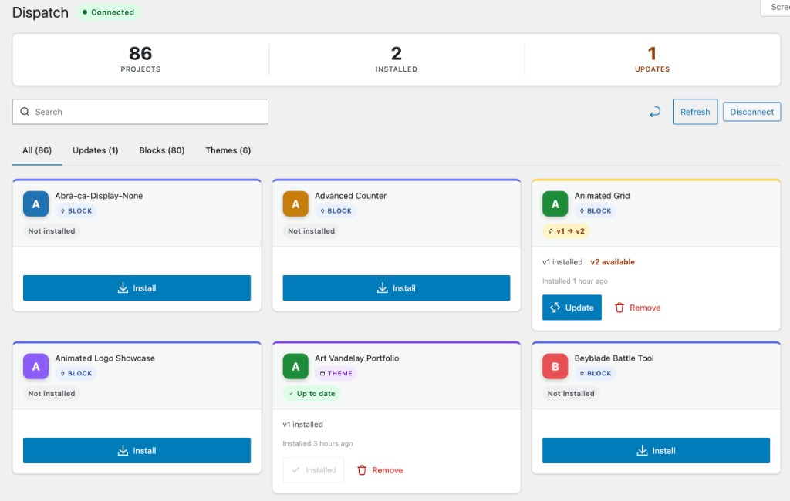

<div align="center">

# Dispatch for Telex

**The missing link between Telex and your WordPress site.**

[](https://github.com/RegionallyFamous/dispatch/actions/workflows/ci.yml)
[](https://github.com/RegionallyFamous/dispatch/releases)
[](https://wordpress.org)
[](https://php.net)
[](https://www.gnu.org/licenses/gpl-2.0.html)

<br/>

[**▶ Try it in your browser — no install needed**](https://playground.wordpress.net/?blueprint-url=https://raw.githubusercontent.com/RegionallyFamous/dispatch/main/blueprint.json)

<sub>Opens a live WordPress Playground with Dispatch pre-installed. Takes about 10 seconds.</sub>

<br/>



</div>

---

## Telex is extraordinary. Getting builds onto your site shouldn't be a chore.

[Telex](https://telex.automattic.ai) is Automattic AI Labs' natural language block and theme builder — described by Matt Mullenweg as "V0 or Lovable, but specifically for WordPress." Describe what you want in plain English. Click **Build**. Two minutes later you have a fully functional, production-quality WordPress block: a Minesweeper game, a pricing table, an EV charging calculator, a complete Gutenberg theme. Without writing a single line of code.

Thousands of creators are using it to ship things they couldn't have built otherwise. The generation is fast, the output is real, and the creative loop is genuinely exciting.

Then you hit the zip file.

---

## The last mile problem

Every time you build something in Telex — or revise it, or iterate on it — deploying it to WordPress follows the same soul-crushing script:

1. Click **Download** in Telex
2. Hunt for the file in your Downloads folder
3. Switch over to your WordPress admin
4. Navigate to **Plugins → Add New → Upload Plugin**
5. Click **Choose File** and find the zip again
6. Wait for the upload
7. Click **Install Now**, then **Activate**

**Seven steps. Per block. Per revision. Per site.**

The generation took two minutes. The deploy cycle takes five — and it repeats from scratch every single time you make a change. If you're managing a client site with a dozen Telex blocks, you're doing this over and over, for every update, across every environment.

It's not a workflow. It's friction. And it compounds.

---

## Dispatch eliminates the loop entirely.

Install Dispatch. Connect it to your Telex account once — takes about 30 seconds. Your entire Telex project library appears inside WordPress admin. Every block, every theme, every revision.

**Click Install. It's done.**

No download. No upload form. No file management. Dispatch handles the fetch, the validation, the install, and the activation. The same mechanism WordPress uses for every other plugin — just automatic.

Update a block in Telex? The update badge appears in your WordPress admin just like any other plugin update. Click it. Done. Or set auto-update and never click anything.

---

## Everything you'd expect. And then some.

| | |
|---|---|
| **One-click install & update** | Dispatch fetches the build, validates every file against a SHA-256 checksum, runs it through the WordPress Upgrader API, and activates it. No zip. No upload. No round trips. |
| **Native WordPress updates** | Telex updates show up on the standard WordPress Updates screen alongside everything else. Your team's existing workflow doesn't change. |
| **Stars & favorites** | Star any project to pin it to the top of your library. Sort by "Starred first" so the things you rely on are always front and center. |
| **Freeform tags** | Tag projects however you like — up to 20 tags per project. Filter the entire library to a single tag in one click. |
| **Bulk actions** | Select multiple projects with checkboxes and install, update, or remove them all at once. A sticky action bar appears the moment you check the first box. |
| **Config export / import** | Export all your pins, notes, tags, groups, and auto-update settings as a JSON file. Import on any other site to replicate the full setup instantly. |
| **Build snapshots** | Before a big change, capture the installed state of every project. If something breaks, restore in one command. Your safety net for risky deploys. |
| **Version pinning** | Lock any project at a specific build. Pinned projects are immune to updates — including `wp telex update --all` — until you're ready to move. |
| **Auto-update modes** | Per-project control: update immediately, delay 24 hours, or stay pinned. Auto-update the utilities, pin the mission-critical blocks. |
| **Update approval queue** | When a soak period expires, updates move into a visible queue so you can review and approve before anything touches production. |
| **Failed install tracking** | Failed installs are flagged on the card and collected in a dedicated tab. Nothing falls through the cracks. |
| **Dashboard widget** | A compact Dispatch summary right on your WordPress dashboard — installed count, pending updates, API status, and last activity at a glance. |
| **WP-CLI first-class** | `wp telex install`, `wp telex update --all`, `wp telex snapshot create`. Full automation. Drop it in your CI/CD pipeline and every environment stays current. |
| **Multisite** | Connect once at the network level. Every site on the network gets your full project library with no extra setup. |
| **Notification channels** | Email and Slack notifications for installs, updates, and removals. Know exactly what changed, when, and who triggered it. |
| **Block usage analytics** | See how many posts each block appears in. Know which ones are load-bearing before you touch them. |
| **Audit log** | Every action — install, update, remove, connect, disconnect — is logged with a timestamp and acting user. GDPR-ready and registered with WordPress Privacy Tools. |
| **Circuit breaker** | If Telex has a bad moment, Dispatch backs off gracefully and stops hammering the API. Your installed blocks keep running. Everything self-heals automatically. |
| **Site Health integration** | Circuit breaker state and project health surface directly in the WordPress Site Health screen alongside your other checks. |
| **No passwords, ever** | OAuth 2.0 Device Authorization Grant (RFC 8628). One code, one URL, one approval from any device. Nothing stored in plaintext. Nothing to manage. |

---

## Try it in 10 seconds

The fastest way to see Dispatch is WordPress Playground — a complete WordPress environment in your browser. No account, no install.

### [→ Open in WordPress Playground](https://playground.wordpress.net/?blueprint-url=https://raw.githubusercontent.com/RegionallyFamous/dispatch/main/blueprint.json)

Loads pre-logged-in with Dispatch already installed and activated, straight to the projects screen. Connect a Telex account and try the full install flow — or just explore the UI.

---

## Get started

**Requirements:** WordPress 6.7+, PHP 8.2+, a [Telex account](https://telex.automattic.ai) (free).

### Install Dispatch

**From GitHub Releases:**
```bash
# Download dispatch-for-telex-x.x.x.zip from the latest release, then:
# Plugins → Add New → Upload Plugin
```

**Via WP-CLI:**
```bash
wp plugin install https://github.com/RegionallyFamous/dispatch/releases/latest/download/dispatch-for-telex.zip --activate
```

### Connect to Telex

1. Open **Dispatch** in your WordPress admin sidebar.
2. Click **Connect to Telex**.
3. Open the URL shown — on any device, any browser.
4. Sign into Telex and enter the code.
5. Your projects appear. Click **Install** on anything you want live.

That's it. One-time setup. Everything after that is one click per project.

---

## Built for teams and pipelines

```bash
wp telex list                  # See everything and its status
wp telex install <id>          # Install a project
wp telex update --all          # Update everything non-pinned
wp telex snapshot create --name="Before deploy"  # Capture current state
wp telex snapshot restore <id> # Restore if something breaks
wp telex pin <id>              # Lock a project at its current build
```

Drop `wp telex update --all` into your deployment script. Every environment — staging, production, client preview — stays current on every deploy without anyone lifting a finger.

→ [Full WP-CLI Reference](https://github.com/RegionallyFamous/dispatch/wiki/WP-CLI-Reference)

---

## Documentation

Everything lives in the [GitHub Wiki](https://github.com/RegionallyFamous/dispatch/wiki).

| | |
|---|---|
| [Getting Started](https://github.com/RegionallyFamous/dispatch/wiki/Getting-Started) | Install Dispatch and connect to Telex |
| [Managing Projects](https://github.com/RegionallyFamous/dispatch/wiki/Managing-Projects) | Install, update, snapshots, pinning, tags, favorites, groups |
| [WP-CLI Reference](https://github.com/RegionallyFamous/dispatch/wiki/WP-CLI-Reference) | Full command reference |
| [Multisite Setup](https://github.com/RegionallyFamous/dispatch/wiki/Multisite-Setup) | One connection for the whole network |
| [Security Model](https://github.com/RegionallyFamous/dispatch/wiki/Security-Model) | How auth, encryption, and validation work |
| [Troubleshooting](https://github.com/RegionallyFamous/dispatch/wiki/Troubleshooting) | Fixes for common issues |
| [Contributing](https://github.com/RegionallyFamous/dispatch/wiki/Contributing) | Dev setup and PR process |

---

## Contributing

Bug reports and PRs are welcome. Please read [SECURITY.md](SECURITY.md) before reporting a vulnerability — don't open a public issue.

For everything else, [open an issue](https://github.com/RegionallyFamous/dispatch/issues) or see the [Contributing guide](https://github.com/RegionallyFamous/dispatch/wiki/Contributing).

---

<div align="center">

Built by [Regionally Famous](https://regionallyfamous.com) &nbsp;·&nbsp; [GPL-2.0-or-later](https://www.gnu.org/licenses/gpl-2.0.html) &nbsp;·&nbsp; [changelog](CHANGELOG.md)

</div>
